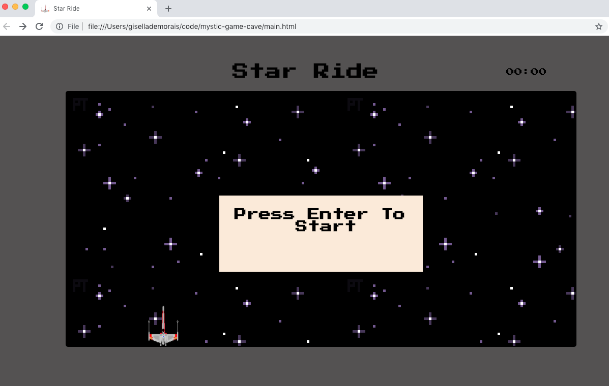
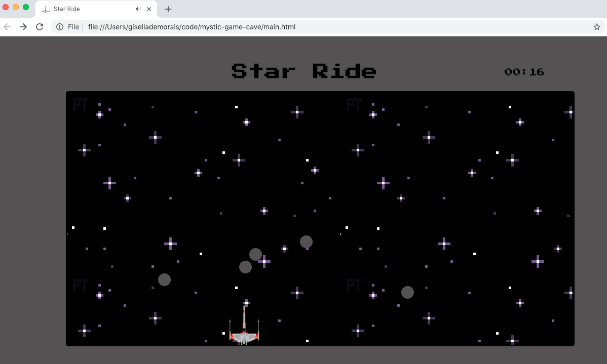
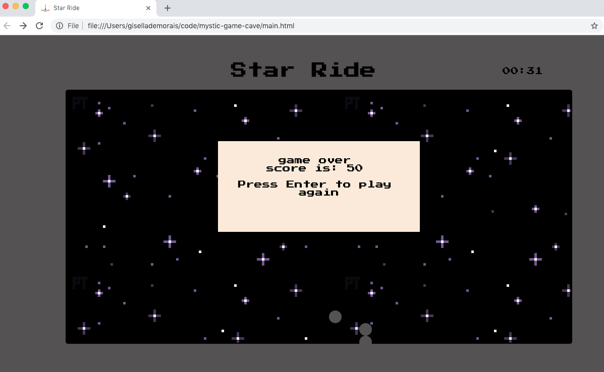

## Star Ride

Star Ride is a game inspired by the Star Wars franchise, where you will be the pilot of the famous X-Wing spaceship.

- The challenge of the game is to dodge rocks that fall from the top.
- Every 5 seconds played, you will score 10pts.
- If you're hit by a rock, game will be over. 

##Game Images

##Technologies Used:

- HTML
- CSS
- JavaScript

##Getting Started:
- Click [here](https://danvieira7.github.io/mystic-cave-game/index.html)  to play it! 

##Next Steps: 
- Make the game responsive to mobile.
- Add a life count.
- Add different rocks that decreases player's life. 
- Add a boss after a certain amount of points scored.

